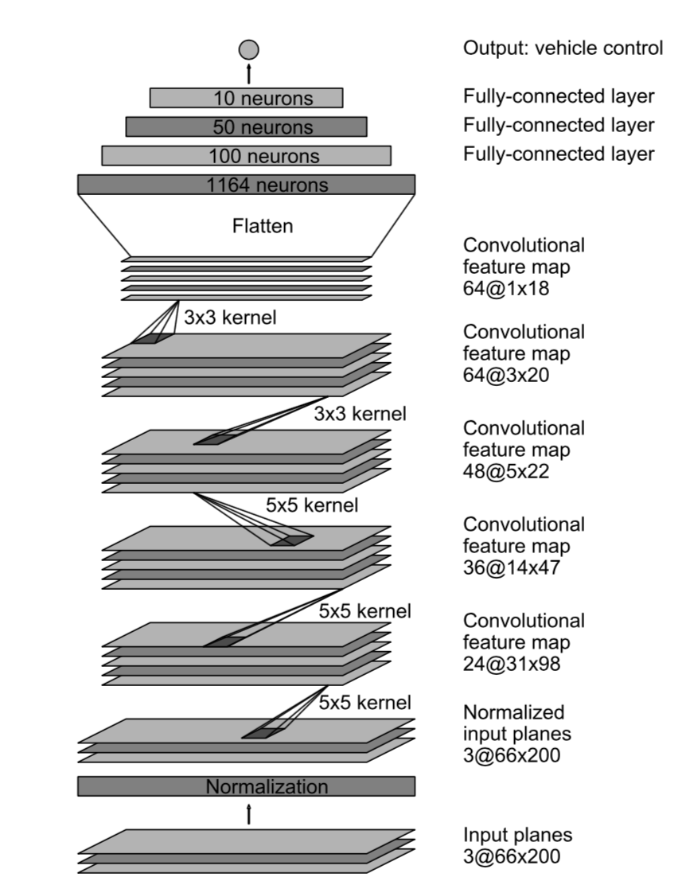
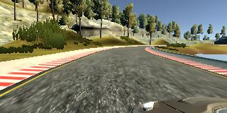
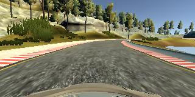
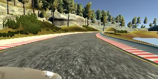
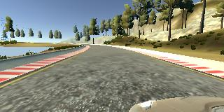
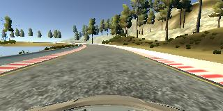
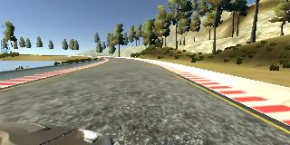

# **Udacity Self-Driving Car Engineer Nanodegree - Behavioral Cloning Project** 

## LIBO Nov/17/2018

### You can use this file as a template for your writeup if you want to submit it as a markdown file, but feel free to use some other method and submit a pdf if you prefer.

---

**Behavioral Cloning Project**

The goals / steps of this project are the following:
* Use the simulator to collect data of good driving behavior
* Build, a convolution neural network in Keras that predicts steering angles from images
* Train and validate the model with a training and validation set
* Test that the model successfully drives around track one without leaving the road
* Summarize the results with a written report


[//]: # (Image References)

[image1]: ./CNN_architecture.png "Model Visualization"
[image2]: ./left_2016_12_01_13_38_53_062.jpg "left image"
[image3]: ./center_2016_12_01_13_38_53_062.jpg "center Image"
[image4]: ./right_2016_12_01_13_38_53_062.jpg "right Image"
[image5]: ./left_2018_11_15_12_58_43_177.jpg "Recovery Left Image"
[image6]: ./center_2018_11_15_12_58_43_177.jpg "Recovery center Image"
[image7]: ./right_2018_11_15_12_58_43_177.jpg "Recovery right Image"

## Rubric Points
### Here I will consider the [rubric points](https://review.udacity.com/#!/rubrics/432/view) individually and describe how I addressed each point in my implementation.  

---
### Files Submitted & Code Quality

#### 1. Submission includes all required files and can be used to run the simulator in autonomous moded

My project includes the following files:
*  model.py containing the script to create and train the model
* drive.py for driving the car in autonomous mode, this file is a modification of the original one provided by Udacity, we limit the maximum speed and the set up the throttle for the sharp turn in case of slipping out of the lane.
* util.py providing the helper functions for the data augumentation and the batch generator.
* model.h5 containing a trained convolution neural network 
* environments.yml conda environment (Use TensorFlow without GPU)
* environments-gpu.yml conda environment (Use TensorFlow with GPU)
* README files (markdown) summarizing the results.
* track1.mp4  well trained result on track1
* track1_not_good.mp4  overfitted result on track1
*  track2.mp4  well trained result on track2
* track2_not_good.mp4 overfitted result on track2.

Since the data files exceed the storage limit 100MB per commit of the github, so they are not listed here. 

#### 2. Submission includes functional code

The customer is recommended to first create folder for preserving the driving_log.csv and the IMG folder, and then  set up the parameters in the model.py so that the driving_log.csv and the IMG folder can be utilized by construct the training data for the neural network.

Second, set up the environment for the CNN training process. You can type the following command in the shell window as:

```sh
# Use TensorFlow without GPU
conda env create -f environment.yml 

# Use TensorFlow with GPU
conda env create -f environment-gpu.yml

```

Double click the `beta_simulator_mac` app, and select the  the training mode in the Udacity provided simulator, then click the record button to select the folder where driving_log.csv and the IMG folder are saved, then try to maneuver the simulated car on the track for more than 10 minutes to gather enough images and labels for training. The weights after the CNN training are saved in the model.h5 file. 


drive.py file, the car can be driven autonomously around the track by executing 

```sh
python drive.py model.h5 run
```

The directory in which to save the images seen by the agent is set to `run` folder.

The images in the `run`  folder are compressed into a mp4 file called run.mp4 by the following command with the  `video.py` file the same as the Udacity presents.

```sh
python video.py run --fps 48
```


#### 3. Submission code is usable and readable

The model.py file contains the code for training and saving the convolution neural network. The file shows the pipeline I used for training and validating the model, and it contains comments to explain how the code works.

The utils.py file contains the code for the useful helper functions  load_image() for loading RGB images from a file, crop() for removing the sky and the car front at the bottom, resize() for resizing the image to the standard size 66x200 and rgb2yuv() to change the rgb channel to the yuv channel in accordance with the end-to-end NVDIA model in the famous paper [the NVIDIA model](https://devblogs.nvidia.com/parallelforall/deep-learning-self-driving-cars/).

### Model Architecture and Training Strategy

#### 1. An appropriate model architecture has been employed

My model consists of 12 layers: 1 normalization layer, 5 convolution layers,  1 drop out layer, 1 flattened layer, and 4 fully-connected layers. The neural network are presented as follows

| Layer         		|     Description	        					| 
|:---------------------:|:---------------------------------------------:| 
| Input         		| 66x200x3 colored YUV image   					| 
| Lambda     	| Transformed with 0 mean and within domain [-1, 1]	|  
| Convolution					|     	 5x5x24 output and 2x2 stride, ELU activation	    |
| Convolution					| 5x5x36 output and 2x2 stride, ELU activation	  |
| Convolution					| 5x5x48 output and 2x2 stride, ELU activation	  |
| Convolution					| 3x3x64 output and 1x1 stride, ELU activation	  |
| Convolution					| 3x3x64 output and 1x1 stride, ELU activation	  |
| Dropout					| drop out 50% nodes   					    |
| Flatten				|  	output (288, )	            			| 
| Fully connected		|  outputs 100									|
| Fully connected		|  outputs 50									|
| Fully connected		|  outputs 10									|
| Fully connected		|  outputs 1									|
The code (lines 39-58 of the model.py) for this framework is listed in the function build_model() as follows:

```python
def build_model(args):
    """
    Modified NVIDIA model
    """
    model = Sequential()
    model.add(Lambda(lambda x: x/127.5-1.0, input_shape=INPUT_SHAPE))
    model.add(Conv2D(24, 5, 5, activation='elu', subsample=(2, 2)))
    model.add(Conv2D(36, 5, 5, activation='elu', subsample=(2, 2)))
    model.add(Conv2D(48, 5, 5, activation='elu', subsample=(2, 2)))
    model.add(Conv2D(64, 3, 3, activation='elu'))
    model.add(Conv2D(64, 3, 3, activation='elu'))
    model.add(Dropout(args.keep_prob))
    model.add(Flatten())
    model.add(Dense(100, activation='elu'))
    model.add(Dense(50, activation='elu'))
    model.add(Dense(10, activation='elu'))
    model.add(Dense(1))
    model.summary()

    return model

```
 

#### 2. Attempts to reduce overfitting in the model

The model contains dropout layers in order to reduce overfitting (model.py lines 40). 

The model was trained and validated on different data sets to ensure that the model was not overfitting (code line 86), the training sets are obtained through manual controling the simulated car. The model was tested by running it through the simulator and ensuring that the vehicle could stay on the track.

#### 3. Model parameter tuning

The model used an adam optimizer, so the learning rate was not tuned manually (model.py line 61). The parameters tuned in this project are listed in the main() function (lines 85-93 in model.py) as numbers of epoch is tuned from 10 to 80, and the size of the manual training data is changed from 336.5 MB to 661 MB, and the sample size is changed from 10000 to 50000. 

#### 4. Appropriate training data

Training data was chosen to keep the vehicle driving on the road. I used a combination of random choice from the left/center/right image to control the steering angle,  randomly flipping the image from right to left or from left to right, so that the model will be robust staying at the center of the lane, randomly shifting the image vertically and horizontally, randomly adding shadow, and randomly adjusting the brightness of the image to augment the data, so that the training data would not be biased by the left turning feature of the track.


### Model Architecture and Training Strategy

#### 1. Solution Design Approach

The overall strategy of the model architecture was based on the model constructed by NVIDIA for the end-to-end self driving test. It seems well suited for the project.

My first step was to use a convolution neural network model similar to the NIDIA model. I thought this model might be appropriate because the [the NVIDIA model](https://devblogs.nvidia.com/parallelforall/deep-learning-self-driving-cars/) is mainly designed fot the similar self-driving problem.


In order to gauge how well the model was working, I split my image and steering angle data into a training and validation set. I found that my first model's validation loss stop improving too soon.  After changing the learning rate from 1.0e-3 to 1.0e-4, the loss could be improved for all epochs. The original 10 epochs seems to be not enough for the training since the validation loss could not be decreased below 0.1, so the number is gradually changed from 10 t0 80, and the 40 epochs might be more appropriate to achive sufficiently low lever of validation loss while keeping the training time in one hour. 


The final step was to run the simulator to see how well the car was driving around track one. There were a few spots where the vehicle fell off the track, some sharp turn or zizag course might be difficult for the simulated car. The simulator without enough training data might not learn the large steering angle,  to improve the driving behavior in these cases, I increase the epochs from 10 to 40 and make more manmade training data produced by the training mode in the simulator.

At the end of the process, the vehicle is able to drive autonomously more than 30 minutes around the track without leaving the road.

#### 2. Final Model Architecture

The final model architecture (model.py lines 18-24) consisted of a convolution neural network with the following layers and layer sizes ...

Here is a visualization of the architecture (note: visualizing the architecture is optional according to the project rubric)

<p align="center">
  
</p>


#### 3. Creation of the Training Set & Training Process

To capture good driving behavior, I first recorded the original 24108 images. The sample image of left lane driving:

<p align="center">
  
</p>

along with the related center lane driving as


<p align="center">
  
</p>


and the similar right lane driving as

<p align="center">
  
</p>

The training on the original dataset provided by Udacity might not be robust, and the car would drive unsteadly along zigzag course and easily drove away from the track and climb up to the hills within 2 minutes as the following shows:

<p align="center">
  
</p>

I then recorded the vehicle by randomly choosing the left/center/right image, randomly choosing the flipping image as well as randomly shifting levels, adjusting brightness etc. The training data grow to 48351 images, and these images show what a recovery looks like as follows


<p align="center">
  
</p>

<p align="center">
  
</p>

<p align="center">
  
</p>

and the simulated car could stay in the middle of the track even it took sharp turns. The well-trained result for track 1 is recorded as
`track1.mp4`

in our github and   could be visualized as the related videos are uploaded in Youtube, as 

[](http://www.youtube.com/watch?v=KvESNw4A_P4 "Track1_Video")

<p align="center">
  
</p>

Then I repeated this process on track two in order to get more data points, however the track two data seems a little more challenging. The abrupt U turn and the uphill/downhill situations are much more frequent than the track one, so it might take many more epochs to achieve equivalent accuracy.

To augment the data sat, I also increase the number of epochs from 40 to 80, then the gradient decent might be able to reach some relatively local optimized point for the validation loss function.


I finally randomly shuffled the data set and put 20% of the data into a validation set. 

I used this training data for training the model. The validation set helped determine if the model was over or under fitting. The ideal number of epochs seems to be around 20 for the more simple situation as track 1, but might need to be around more than 40 epochs to get a more convincing result for track 2.  The terrible result under 40 epochs of training can be viewed from the 

[](http://www.youtube.com/watch?v=FkDMlt7D1ek "Track2_Video_notgood")

<p align="center">
  
</p>

the car will drive out of the track and hit the traffic sign only after less than 2 minutes of self-driving process, the model is not trained enough.

The comparison might be better understood by just looking at the video.For the completed version of results for track one and track two, and 

[](http://www.youtube.com/watch?v=etFrDL1OJDk "Track2_Video")

<p align="center">
  
</p>


